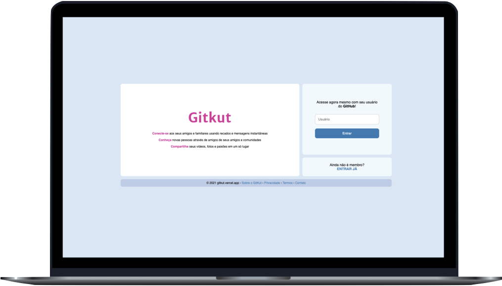
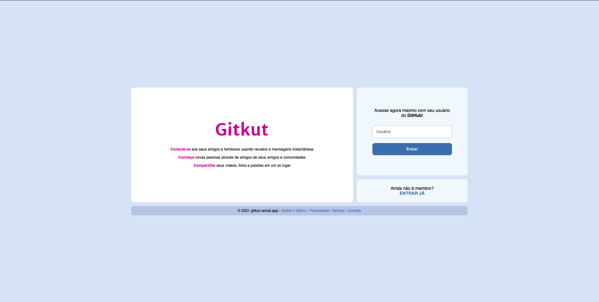
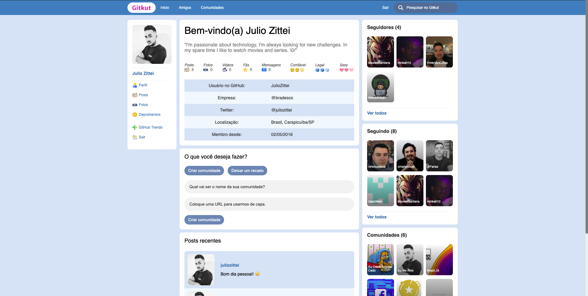
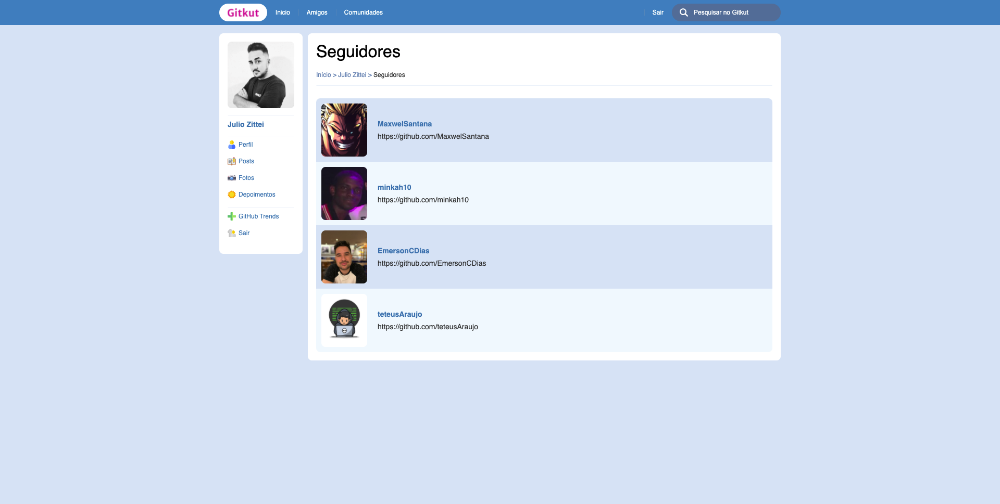
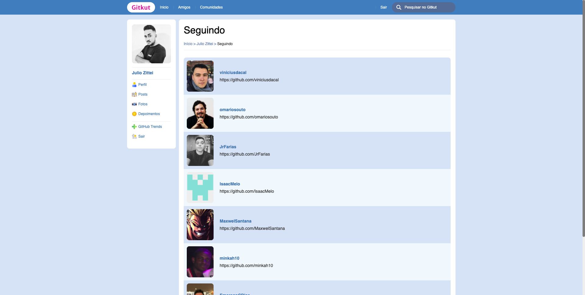
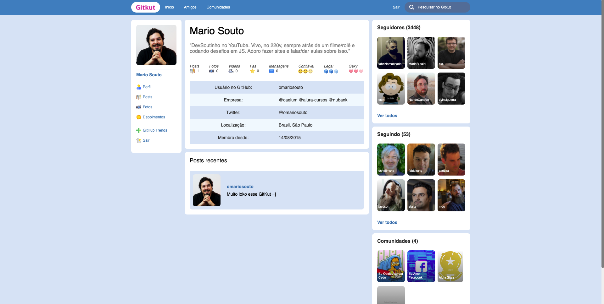
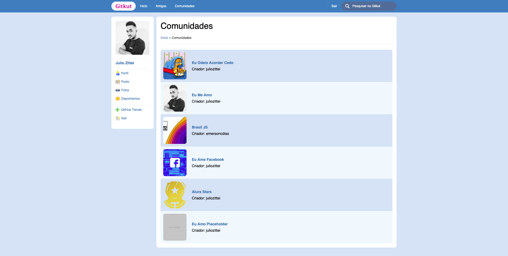
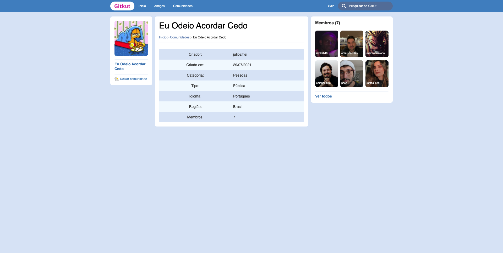
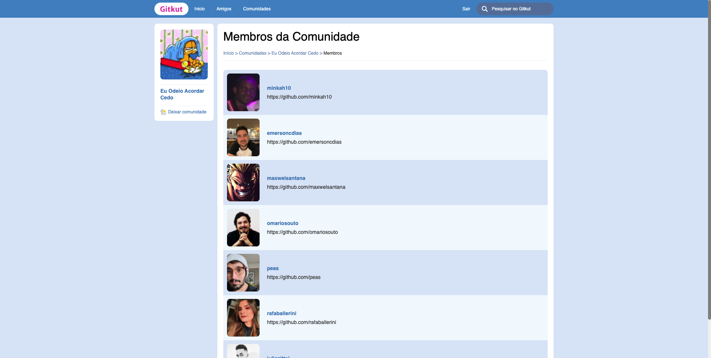

<h1 align="center">
  
</h1>
 
 

  

 

## About the project 💬

The **GitKut** is a web application clone of our dearly departed Orkut, but with a more modern interface and using the best development technologies!

## Pages 🔖

- [Login](#login-page)
- [Profile](#profile-page)
- [Friends](#friends-page)
- [Followers](#followers-page)
- [Following](#following-page)
- [Friend's profile](#friend-profile-page)
- [Communities](#communities-page)
- [Community](#community-page)
- [Community's members](#community-members-page)
- [Logout](#logout-page)

## Features 🧠

The application contains the following features:

### Login page

- Log in with the GitHub username.

  

### Profile page

- View friends (GitHub followers and following);
- Go to friends' profiles;
- View communities that you are member;
- Go to the community page;
- Create a new community;
- See the recent messages;
- Leave new messages;
- Logout.

  

### Friends page

- See all your friends (GitHub followers);
- Click on a friend to go to their profile;
- Click on the link below the username to go to their GitHub profile.

  

### Followers page

- See all your followers (GitHub followers);
- Click on a friend to go to their profile;
- Click on the link below the username to go to their GitHub profile.

  

### Following page

- See all your following (GitHub following);
- Click on a friend to go to their profile;
- Click on the link below the username to go to their GitHub profile.

  

### Friend's profile page

- View the friend's information, including their friends (GitHub followers and following).
- See the friend's friends.

  

### Communities page

- View all created communities;
- Click on a community to go to its page.

  

### Community page

- View community information;
- Participate in the community.

  

### Community's members page

- See all community members.

  

### Logout page

- Exit the application.

  

## How to use? 📌

_To use **Gitkut**, just access it directly in your browser! [Click here](https://gitkut.vercel.app)_

<!-- To use the application on your machine you need to have the following software installed:

- [Node.js](https://nodejs.org/pt-br/)

With the above software installed, simply follow the following steps to run the application on your machine:

1. **Clone the project**  
   Open the terminal in a folder of your choice and paste the following code:

   _`git clone https://github.com/JulioZittei/gitkut.git`_

2. **Install the dependencies**  
   Inside the project directory, open the terminal and paste the code:

   _`npm install`_ or _`yarn`_

_Or access **Gitkut** in your browser! [Click here](https://gitkut.vercel.app)_ -->

## Technologies 🛠

Developed using the following technologies:

- [React](https://reactjs.org)
- [Next.js](https://nextjs.org/)
- [DatoCMS](https://www.datocms.com/)

---

Made with ❤ by: Julio Zittei 

